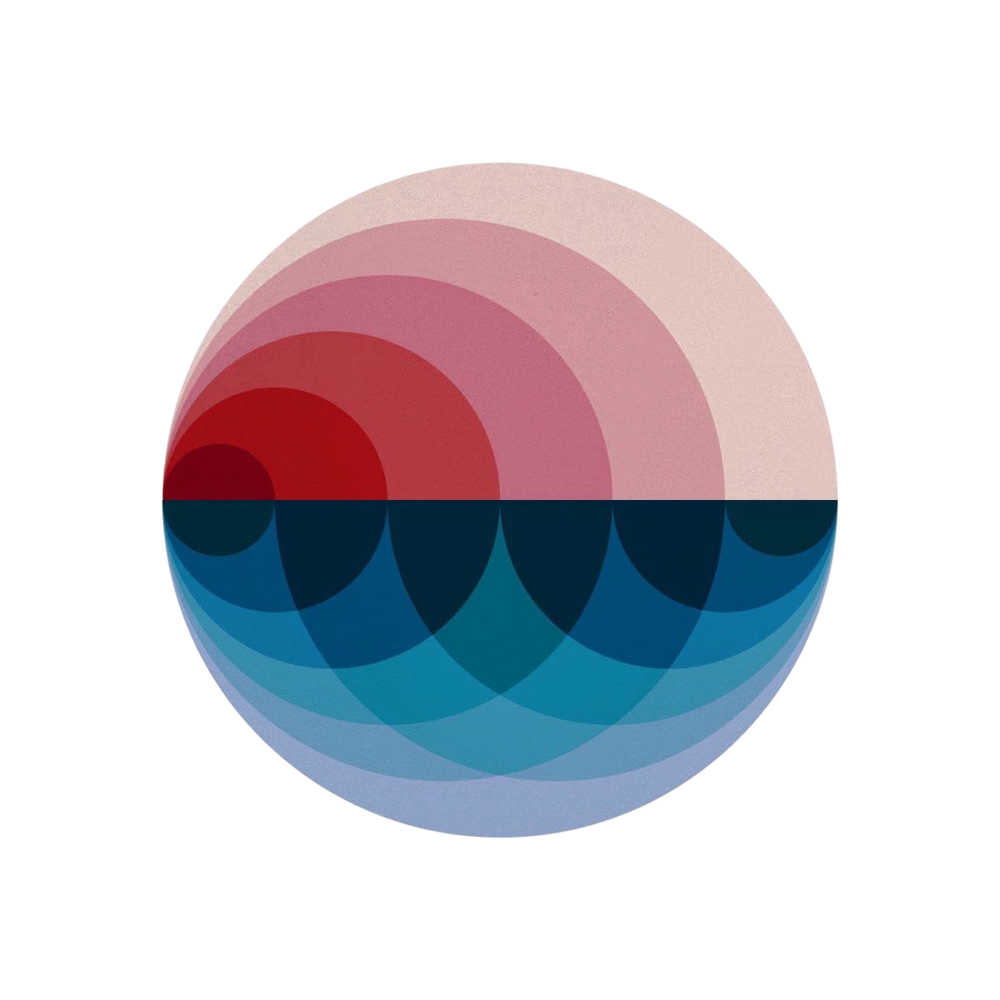
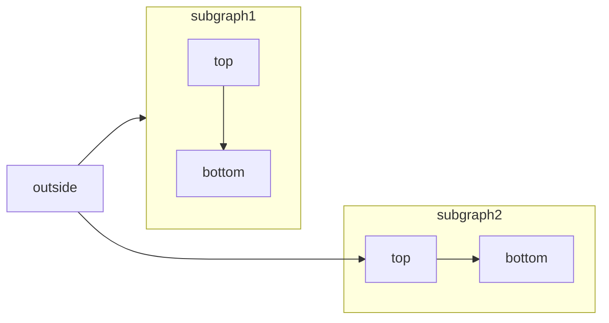

# Creating pages
All pages must start with a yaml header.

```yaml
---
title: My Page # required
description: This is a description of my page # optional
sidebarTitle: My Page # optional
---
```

# links

You can do internal links by using the following syntax:
```mdx
[My Page](/guides/my_page) # must be path relative to `docs` folder
```


# Text
> You can do blockquotes like this

> or multiline blockquotes 
> like this

Your can do inline latex $e = mc^2$
or block equations
$$
E = mc^2
$$

Seperate paragraps

With blank lines

# Images and Video
Regular markdown images work


And so do html images


Youtube embeds also work
<iframe
  className="w-full aspect-video rounded-xl"
  src="https://www.youtube.com/embed/4KzFe50RQkQ"
  title="YouTube video player"
  frameBorder="0"
  allow="accelerometer; autoplay; clipboard-write; encrypted-media; gyroscope; picture-in-picture"
  allowFullScreen
></iframe>

# Tables
| Property | Description                           |
| -------- | ------------------------------------- |
| Name     | Full name of user                     |
| Age      | Reported age                          |
| Joined   | Whether the user joined the community |

# Code

Add titles with
```javascript Code Block Example
const hello = "world";
```

Highlight lines
```javascript Line Highlighting Example highlight={1-2,5}
const greeting = "Hello, World!";
function sayHello() {
  console.log(greeting);
}
sayHello();
```

focus lines
```javascript Line Focus Example focus={2,4-5}
const greeting = "Hello, World!";
function sayHello() {
  console.log(greeting);
}
sayHello();
```

Make expandable
```python Expandable Example expandable
from datetime import datetime, timedelta
from typing import Dict, List, Optional
from dataclasses import dataclass

# ...

if __name__ == "__main__":
    main()
```

Enable text wrapping
```javascript Wrap Example wrap
const greeting = "Hello, World! I am a long line of text that will wrap to the next line.";
function sayHello() {
  console.log(greeting);
}
sayHello();
```

Diffs
```js Diff Example icon="code" lines
const greeting = "Hello, World!"; // [!code ++]
function sayHello() {
  console.log("Hello, World!"); // [!code --]
  console.log(greeting); // [!code ++]
}
sayHello();
```

# Callouts
<Note>This adds a note in the content</Note>
<Warning>This raises a warning to watch out for</Warning>
<Info>This draws attention to important information</Info>
<Tip>This suggests a helpful tip</Tip>
<Check>This brings us a checked status</Check>
<Danger>This is a danger callout</Danger>
<Callout icon="key" color="#FFC107" iconType="regular">This is a custom callout</Callout>

# icons
<Icon icon="flag" size={32} />
<Icon icon="flag" iconType="solid" /> The documentation you want, effortlessly.

# Mermaid


# Steps
<Steps>
  <Step title="First Step">
    These are instructions or content that only pertain to the first step.
  </Step>
  <Step title="Second Step">
    These are instructions or content that only pertain to the second step.
  </Step>
  <Step title="Third Step">
    These are instructions or content that only pertain to the third step.
  </Step>
</Steps>

# Tabs

<Tabs>
  <Tab title="First tab">
    ☝️ Welcome to the content that you can only see inside the first tab.

    You can add any number of components inside of tabs. For example, a code block:
    ```java HelloWorld.java
      class HelloWorld {
          public static void main(String[] args) {
              System.out.println("Hello, World!");
          }
      }
    ```
  </Tab>
  <Tab title="Second tab" icon="leaf">
    ✌️ Here's content that's only inside the second tab.

    This one has a <Icon icon="leaf" /> icon!
  </Tab>
  <Tab title="Third tab">
    💪 Here's content that's only inside the third tab.
  </Tab>
</Tabs>

# Tooltips
<Tooltip tip="This is a tooltip!" cta="Learn more about changelogs" href="/components/update">Hover over me</Tooltip>

# Updates
Use the Update component to display changelog entries, version updates, and release notes with consistent formatting. 
<Update label="2024-10-11" description="v0.1.0" tags={["Mintlify"]}>
  This is an update with a label, description, and tag.
</Update>

# Accordions
Accordions
<Accordion title="I am an Accordion.">
  You can put any content in here, including other components, like code:

   ```java HelloWorld.java
    class HelloWorld {
        public static void main(String[] args) {
            System.out.println("Hello, World!");
        }
    }
  ```
</Accordion>


Accordion groups
<AccordionGroup>
  <Accordion title="Getting started">
    You can put other components inside Accordions.

    ```java HelloWorld.java
    class HelloWorld {
        public static void main(String[] args) {
            System.out.println("Hello, World!");
        }
    }
    ```
  </Accordion>

  <Accordion title="Advanced features" icon="alien-8bit">
    Add icons to make accordions more visually distinct and scannable.
  </Accordion>

  <Accordion title="Troubleshooting">
    Keep related content organized into groups.
  </Accordion>
</AccordionGroup>

